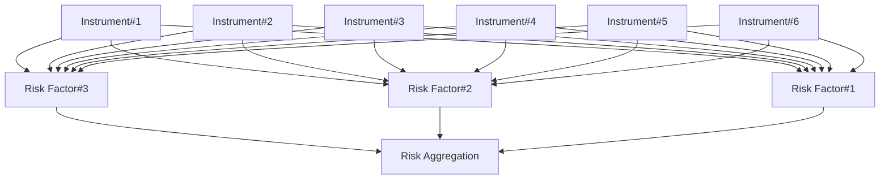

## Estimating VaR
 - **Normal VaR**
$VaR = - (\mu-z_{\alpha}\sigma)$
$VaR = - (\mu-z_{\alpha}\sigma)P_{t-1}$
-  **Lognormal VaR**
$VaR = 1-e^{\mu-z_{\alpha}\sigma}$
$VaR = (1-e^{\mu-z_{\alpha}\sigma})P_{t-1}$
- **Expected Shortfall / Conditional VaR (CVaR) / Tail Conditional Expectation / Conditional.**
- **Loss / Expected Tail Loss: expected value of the loss when it exceeds VaR**

## Quantile - Quantile Plots
- **The quantile-quantile (QQ) plot** is a visual inspection of an empirical quantile relative to a hypothesized theoretical distribution. If the empirical distribution closely mathes the theoretical distribution, the QQ plot would be linear.

## Coherent Risk Measures
- **Monotonicity: if $X_{1}\leq X_{2}$, $\rho(X_{1})\geq \rho(X_{2})$.**
In other words, if a portolio has systematically lower values than another (in each state of the world), it must have great risk. Standard deviation violates the monotonicity condition.
- **Translation Invariance: $\rho(X+k) = \rho(X)-k$.**
In other words, adding cash k to a portfolio should reduce its risk by k. This reduces the lowest portfolio value. As with X, k is measured in dollars.
- **Homogeneity: $\rho(bX)=b\rho(X)$.**
In other words, increasing the size of a portfolio by a factor b should scale its risk measure by the same factor b. This property applies to the standard deviation.
- **Subadditivity: $\rho(X_{1}+X_{2})\leq \rho(X_{1})+\rho(X_{2})$**
In other words, the risk of a portfolio must be less than the sum of separate risks. Merging porfolios cannot increase risk. VaR violates the subadditivity condition.

## Non-Parametric Approach and Hybrid Approach
- **Bootstrap historical simulation approach:** involves repeated sampling with replacement, the 5% VaR is recorded from each sample draw. The average of the VaRs from all the draws is the VaR estimate. Note: empirical analysis demonstrates that the bootstrapping technique consistently provides more precise estimates of coherent risk measures than historical simulation on raw data alone.
- **Weighted historical simulation approach:**
Age-weighted historical simulation:
$$
\omega_{i}=\frac{\lambda^{i-1}(1-\lambda)}{1-\lambda ^n}
$$
Volatility-weighted historical simulation:
$$
\frac{r^{*}_{t,i}}{r_{t,i}}=\frac{\sigma_{T,i}}{\sigma_{t,i}}
$$
Correlation-weighted historical simulation: Intuitively, the historical correlation matrix needs to be adjusted to the new informationenvironment. This is accomplished, loosely speaking, by "multiplying" the historic returns by the revised correlation matrix to yield updated correlation-adjusted returns.
Filtered historical simulation: Combines the traditional historical simulation model with GARCH model.

## Backtesting VaR
- **Discrete Distribution; Using Filure Rates in Model Verification N/T**
$H_{0}$:accurate model	$H_{a}$:inaccurate model
Test statistic:
$$
LR_{uc}=-2ln[(1-P)^{T-N}P^{N}]+2ln\{[1-(N/T)]^{T-N}(N/T)^{N}\}
$$
P: the probability of exception, P=1-C
N: the number of exceptions
T: the number of samples
If LR > 3.84, we would reject the hypothesis that the model is correct.

| Basel 	| Penalty 	| Zone 	|
|:------:	|:----------:	|:-------------:	|
| Zone 	| Exceptions 	| Multiplier(k) 	|
| Green 	| 0 to 4 	| 3.00 	|
| Yellow 	| 5 	| 3.40 	|
|  	| 6 	| 3.50 	|
|  	| 7 	| 3.65 	|
|  	| 8 	| 3.75 	|
|  	| 9 	| 3.85 	|
| Red 	| 10 or more 	| 4.00 	|
- **Type I error** : reject the correct model.
- **Type II error**: accept the wrong model.

## VaR Mapping
-

- **Three approaches for mapping a fixed income porfolio onto the risk factors**
**Principal mapping**. Only the risk associated with the return of principal at the maturity of the bond is mapped. Principal mapping includes only the risk of repayment of the principal amounts.
**Duration mapping.** The risk of the bond is mapped to a zero-coupon bond of the same duration. Duration mapping uses the duration of the porfolio to calculate the VaR.
**Cash flow mapping.** The risk of the bond is decomposed into the risk of each of the bonds' cash flows. Cash flow mapping is the most precise method because we map the present value of the cash flows (face amount discounted at the spot rate for that maturity) onto the risk factors for zeros of the same maturities and include the inter-matruity correlations.
- **Mapping Approaches for Linear Derivatives**
**Long currency forward contract =** 
long foreign currency spot + 
long foreign currency bill + 
short U.S. dollor bill
**Long 6 X 12 FRA =**
long 6-month bill + 
short 12-month bill
**Long call option =**
long N($d_{1}$) X asset + 
short N($d_{2}$) X bill
**Long put option =**
long N(-$d_{2}$) X bill + 
short N(-$d_{1}$) X asset
Linear approximations may be acceptable for options with long maturities when the risk horizon is short.

## Correlations and Copulas
- **Correlation:**
$$
\rho(X,Y) = \frac{Cov(X,Y)}{\sigma(X)\sigma(Y)}
$$
- **Spearman's rank correlation:**
$$
\rho_{s}=1-\frac{6\sum^{n}_{i=1}d^{2}_{i}}{n(n^{2}-1)}
$$
- **Kendall's $\tau$:**
$$
\tau = \frac{n_{c}-n_{d}}{n(n-1)/2}
$$
- **Copula:**
$$
C_{GD}[Q_{i}(t),,Q_{n}(t)]=M_{n}[N^{-1}(Q_{1}(t)),,N^{-1}(Q_{n}(t));\rho_{M}]
$$
$Q_{i}(t)$: cumulative default probability of asset i at time t.
$C_{GD}$: Gaussian default time copula.
$M_{n}$: the joint, n-variate cumulative standard normal distribution.
$\rho_{M}$: the n*n symmetric, positive-definite correlation matrix of the n-variate normal distribution $M_{n}$.
- **Mean Reversion**:
Mean reversion is present if there is a negative relationship between the change of a variable, $S_{t}-S_{t-1}$, and the variable $S_{t-1}$.
$$
S_{t} = a(\mu_{s}-S_{t-1})+S_{t-1}
$$
$$
Y = \alpha + \beta X
$$
$$
\underbrace{S_{t}-S_{t1}}_{Y}=\underbrace{a\mu_{s}}_{\alpha}-\underbrace{aS_{t-1}}_{\beta X}
$$
- **Autocorrelation is the opposite property of mean reversion.**

## Empirical Approaches to Risk Metrics and Hedge
- Denoting the face amounts of the real and nominal bonds by FR and FN and their DV01s by DV01$^{R}$ and DV01$^{N}$, the regression-based hedge, characterized earlier as the DV01 hedge adjusted for the average change of nominal yields relative to real yields, can be written as follows:
$$
F^{R} = - F^{N} \times \frac{DV01^{N}}{DV01^{R}} \times \hat{\beta}
$$
- The hedge of the first equation minimizes the variance of the P&L in over the data set and used to estimate the regression parameters.

## Covexity Effect
- The convexity effect can be measured by applying a spcial case of Jensen's inequality as follows:
$$
E[\frac{1}{(1+r)}] > \frac{1}{E(1+r)}
$$
- All else held equal, the value of convexity increases with maturity and volatility.

## Term Structure Models
- **Model 1:** assumes no drift and that interest rates are normally distributed:
$dr = \sigma dw$
$dw=\varepsilon\sqrt{dt}$
- **Model 2:** adds a positive drift term to Model 1 that can be interpreted as a positive risk premium associated with longer time horizons:
$dr = \lambda dt + \sigma dw$
- **Ho-Lee Model:** generalizes drift to incorporate time-dependency:
$dr = \lambda (t)dt + \sigma dw$
- **Vasicek Model:** assumes a mean-reverting process for short-term interest rates:
$dr = k(\theta-r)dt + \sigma dw$
$k$ = a parameter that measures the speed of reversion adjustment.
$\theta$ = long-run value of the short-term rate assuming risk neutrality.
$r$ = current interest rate level.
- **Model 3:** assigns a specificparameterization of time-dependent volatility:
$dr = \lambda (t)dt + \sigma e^{-\alpha t}dw$
where:
$\sigma$ = volatility at t = 0, which decreases exponentially to 0 for $\alpha$ > 0
- **Cox-Ingersoll-Ross (CIR) Model:** meanreverting model with constant volatility, $\sigma$, and basis-point volatility, $\sigma\sqrt{r}$, that increases at a decreasing rate:
$dr = k (\theta - r)dt + \sigma\sqrt{r}dw$
- **Model 4 (lognormal model):** yield volatility, $\sigma$, is constant, but basis=point volatility, $\sigma r$, increases with the level of the short-term rate. There are two lognormal models of importance:
**Lognormal with deterministic drift**
$$
d[ln(r)] = a(t)dt + \sigma dw
$$
**Lognormal with mean reversion**
$$
d[ln(r)] = k(t)[ln\theta(t)-ln(r)]dt + \sigma(t)dw
$$

## Interest Rate Tree (Binominal) Model
- **Using backward induction, the value of a bond at a given node in a binomial tree is** the average of the present values of the two possible values from the next period. The appropriate discount rate is the forward rate assocated with the node under analysis.
There are three basic steps to valuing an option on a fixed-income instrument using a binomial tree:
**Step1:** Price the bond value at each node using the projected interest rates.
**Step2:** Calculate the intrinsic value of the derivative of the derivative at each node at maturity.
**Step3:** Calculate the expected discounted value of the derivative at each node using the risk-neutral probabilities and work backward through the tree.

## Volatility Smile
- **Put-call parity** indicates that the deviation between market prices and Black-Scholes-Merton prices will be equivalent for calls and puts. Hence, implied volatility will be the same for calls and puts.
$$
P_{BS} - P_{mkt} = C_{BS}- C_{mkt}
$$
- **For Foreign Exchange Options**
Volatility increases as options become increasingly in the money or out of the money.
- **For Equity Options**
Volatility higher for ITM Call and OTM Puts